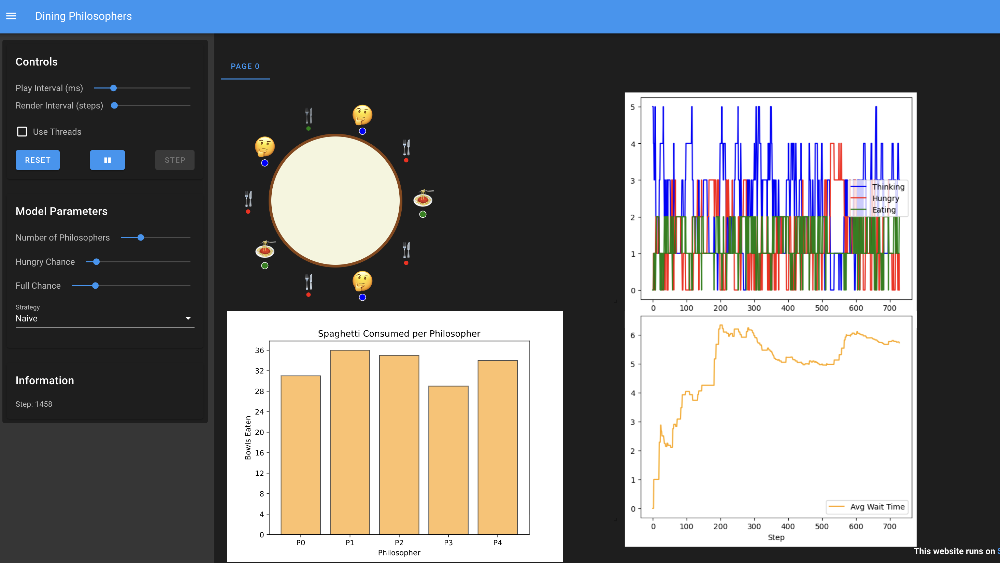

# Dining Philosophers Model



This is a Mesa implementation of the classic [Dining Philosophers Problem](https://en.wikipedia.org/wiki/Dining_philosophers_problem). It demonstrates agent resource contention, deadlock scenarios, and different resolution strategies.

## Overview

Five silent philosophers sit at a round table with bowls of spaghetti. Forks are placed between each pair of adjacent philosophers.

Each philosopher must alternately think and eat. However, a philosopher can only eat spaghetti when they have both left and right forks. Each fork can be held by only one philosopher and so a philosopher can use the fork only if it is not being used by another philosopher. After an individual philosopher finishes eating, they need to put down both forks so that the forks become available to others. A philosopher can take the fork on their right or the one on their left as they become available, but cannot start eating before getting both forks.

## Strategies implemented

This model implements three strategies for fork acquisition:

1.  **Naive**:
    *   The philosopher tries to pick up the left fork first.
    *   If successful, they try to pick up the right fork.
    *   If the right fork is busy, they keep holding the left fork and wait.
    *   **Consequence**: High risk of deadlock. If all philosophers pick up their left fork simultaneously, they all wait forever for the right fork.

2.  **Atomic**:
    *   The philosopher checks if *both* forks are available.
    *   They only pick up forks if both can be acquired simultaneously.
    *   **Consequence**: Prevents deadlock (Hold and Wait condition removed), but some philosophers might starve if neighbors are greedy.

3.  **Cooperative**:
    *   Based on the Atomic strategy (checking both forks).
    *   Adds a negotiation layer: If a neighbor is also hungry and has been waiting longer (or has a lower ID in case of ties), the philosopher yields and does not pick up forks.
    *   **Consequence**: Prevents deadlock and improves fairness, reducing variance in wait times.

## Visualization

The Solara-based visualization includes:
*   **Dining Table**: An animated SVG showing philosophers (Thinking 🤔, Hungry 🤤, Eating 🍝) and forks (Green=Free, Red=Used).
*   **Charts**:
    *   **State Plot**: Real-time line chart of total philosophers in each state.
    *   **Spaghetti Consumed**: Dynamic bar chart showing total bowls eaten by each philosopher.
    *   **Avg Wait Time**: Line chart tracking the average time philosophers spend hungry before eating.

## Model Parameters

*   **Number of Philosophers**: Controls the total number of philosophers at the table (default: 5). The simulation creates a circular table where each philosopher sits between two forks.
*   **Hungry Chance**: Probability (0.0 - 1.0) that a "Thinking" philosopher becomes "Hungry" at each step. Higher values increase resource contention.
*   **Full Chance**: Probability (0.0 - 1.0) that an "Eating" philosopher becomes "Thinking" (puts down forks) at each step. Higher values mean philosophers eat faster and release forks sooner.
*   **Strategy**: The algorithm philosophers use to acquire forks (Naive, Atomic, or Cooperative), as described above.

## How to Run

1.  Install dependencies:
    ```bash
    pip install mesa[rec]
    ```

2.  Run the app:
    ```bash
    solara run app.py
    ```
